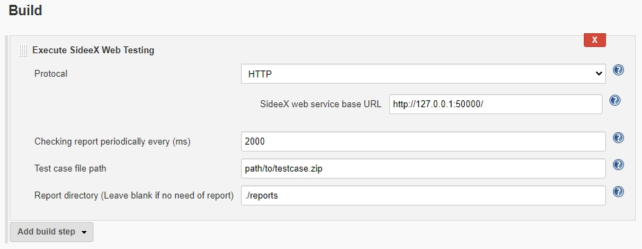
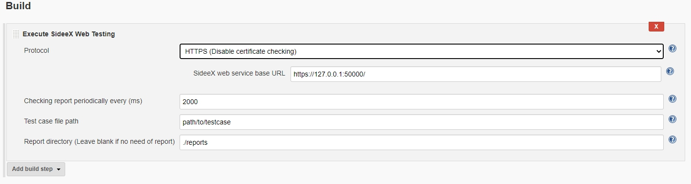
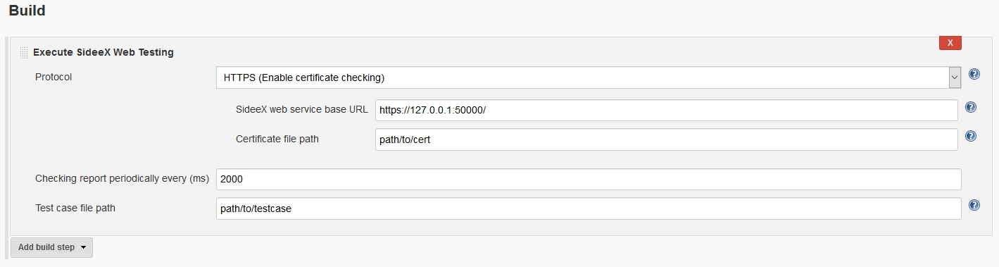
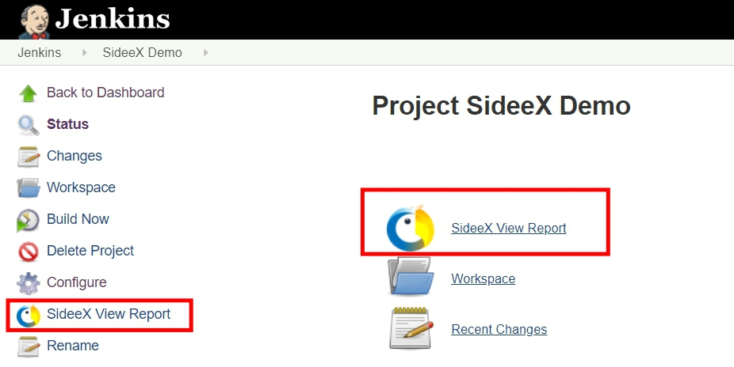
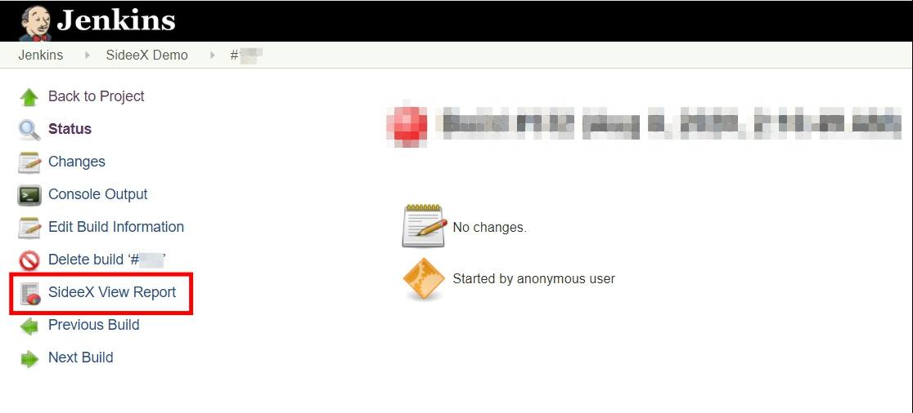

# sideex-plugin-for-jenkins

SideeX Plugin is a tool that supports playing SideeX-recorded test cases through SideeX WebService Web API. 

See [this document](https://hackmd.io/@sideex/book/%2F%40sideex%2Fwebservice-jenkins-plugin) for more information.

## version 1.0.3
Support SideeX WebService 3.7.3

## version 1.0.2
Support SideeX WebService 3.4.0

## version 1.0.1
Support SideeX WebService 3.3.12

## version 1.0
Support SideeX WebService 3.3.11
